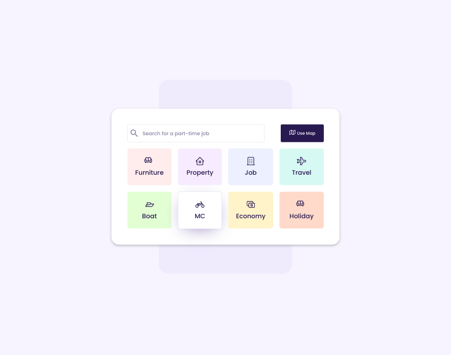
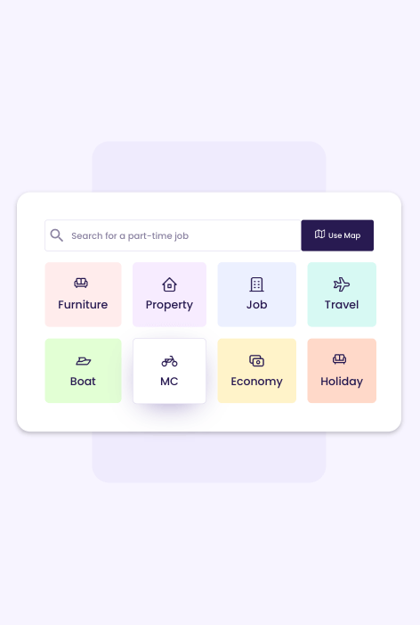
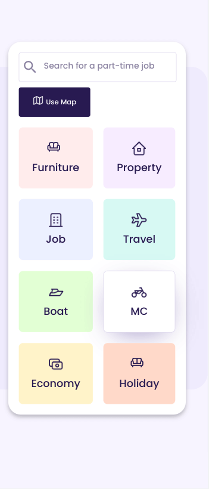

<h1 align="center">UI Design Daily - #1552 Search Categories</h1>

## Table of contents

- [Overview](#overview)
- [Screenshots](#screenshots)
- [Continued Development](#continued-development)
- [Useful Resources](#useful-resources)

## Overview

[UI Design Daily design](https://www.uidesigndaily.com/posts/figma-search-categories-day-1552) translated to real code.  

## Screenshots

## Continued Development

- a lot of ui design daily designs are not mobile friendly / practical
- started on desktop design first
- accessibility
- h2 change to p ? *skipping heading level* 
- semantic html improvements
- made tile wrapper div a button tag - easier to tab thru 
- onchange handler for input
- need form tag wrapping map button?

## Useful Resources

- [Material Design Icons](https://www.materialdesignicons.com) - sofa-outline
- [Stack Overflow](https://stackoverflow.com/questions/15885444/why-cant-a-button-element-contain-a-div) - button element can't contain a div